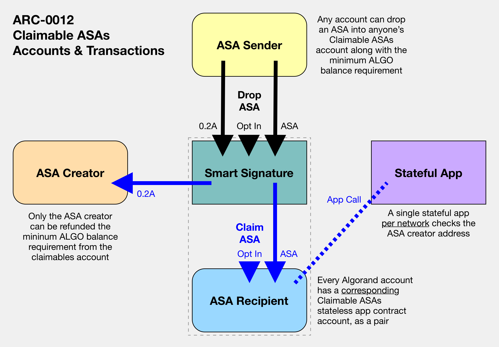

# Claimable Algorand Standard Assets (ASAs)

## Summary

A standard for TEAL contract accounts to serve as a pending claimables account for Algorand Standard Assets for an intended recipient that is not opted in to the ASA.

## Abstract

The goal of this standard is to establish a standard in the Algorand ecosytem by which ASAs can be sent to an intended recipient even if their account is not opted in to the ASA.  TEAL smart signature contract account serves as a pending claimables account with logic that permits opting into incoming ASAs and subsequently for only the intended recipient to claim the ASA into their main account.  An associated stateful contract enables a cost--the minimum balance requirement to create an account and hold an ASA--to be refunded to the ASA creator when the asset is claimed.  If integrated into ecosystem technologies including wallets, epxlorers, and dApps, this standard can provide enhanced capabilities around ASAs which are otherwise strictly bound at the protocol level to require opting in to be received.

## Motivation

Algorand requires users to opt in to receive any ASA, a fact which simultaneously:

1. Grants account holders fine-grained control over the contents of their account by allowing them to select what assets to allow and preventing any unwanted tokens from appearing in their balance.
2. Annoys users when transactions fail and must be submitted after completing an opt in transaction--or asking someone else to do so.  This routine is jarring to people who are new to Algorand or are accutomed other blockchains without this requirement.

This ARC lays out a new way to navigate the ASA opt in requirement.  

### Contemplated Use Cases

The following use cases help explain how this capability can enhance the possibilities within the Algorand ecosystem.

#### Airdrops

An ASA creator who wants to send their asset to a set of accounts faces the challenge of needing their intended recipients to opt in to the ASA ahead of time, which requires non-trivial communication efforts and precludes the possibility of completing the airdrop as a surprise.  This claimable ASA standard creates the ability to send an airdrop out to individual addresses so that the recipients can opt in and claim the asset at their convenience--or not, if they so choose.  

#### Reducing New User On-boarding Friction

An application operator who wants to on-board users to their game or business may want to reduce the friction of getting people started by decoupling their application on-boarding process from the process of funding a non-custodial Algorand wallet, if users are wholly new to the Algorand ecosystem.  As long as the recipient's address is known, an ASA can be sent to them ahead of them having ALGOs in their wallet to cover the minimum balance requirement and opt in to the asset.

## Specification

The key words "**MUST**", "**MUST NOT**", "**REQUIRED**", "**SHALL**", "**SHALL NOT**", "**SHOULD**", "**SHOULD NOT**", "**RECOMMENDED**", "**MAY**", and "**OPTIONAL**" in this document are to be interpreted as described in [RFC-2119](https://www.ietf.org/rfc/rfc2119.txt).

> Comments like this are non-normative.

### Definitions

- **Claimable ASA**: An Algorand Standard Asset (ASA) which has been transferred to a claimables account following the standard set forth in this proposal such that only the intended recipient account can claim it at their convenience.  
- **Claimables Account**: An Algorand contract account derived deterministically from the account of an intended ASA recipient plus a stateless TEAL smart signature that approves transactions originating from it.  
- **dApp**: A decentralized application frontend, interpreted here to mean an off-chain frontend (a webapp, native app, etc.) that interacts with Applications on the blockchain.
- **Explorer**: An off-chain application that allows browsing the blockchain, showing details of transactions.
- **Wallet**: An off-chain application that stores secret keys for on-chain accounts and can display and sign transactions for these accounts.

### Transaction Model

To be added

### TEAL Smart Contracts

[To be added...]

## Rationale

This design was created to offer a standard mechanism by which wallets, explorers, and dapps could enable users to send, receive, and find claimable ASAs without requiring any changes to the core protocol.  

## Reference Implementation

To demonstrate how to interact with a claimable ASA account, a simple application has been deployed here: [https://claimable-asa-demo.netlify.app/](https://claimable-asa-demo.netlify.app/).

The demo site is a client side-only React single page application with MyAlgo wallet integration that provides the following functions:

1. Displaying a connected "main" account's current assets
2. Deriving the connected account's *associated claimable ASAs account* using the standard TEAL smart signature code
3. Displaying any ASAs in the claimables account which can be claimed by the connected "main" account
4. A utility to send ASAs from the connected account to an intended recipient, dynamically diverting the transfer to the appropriate claimable ASAs account if the recipient is not opted in to the ASA.

With this toolset it is possible to view one's own claimables account, claim ASAs from it, and automatically utilize other people's claimables account to send them any ASA.

## Backwards Compatibility

This ARC makes no changes to the consensus protocol and creates no backwards compatibility issues.

## Security Considerations

To be added

## Copyright

Copyright and related rights waived via [CC0](https://creativecommons.org/publicdomain/zero/1.0/).
